# Rescue Animal Capstone Project

### Description

This full-stack application to manage search and rescue animals was my capstone project for my undergraduate program. This project enhanced an [application](https://github.com/S-Spence/Rescue_Animal_Search_Dashboard "Rescue Animal Project") developed in my junior year. The original project utilized MongoDB for the database, PyMongo for the middleware, and Dash for the user interface. The artifact allows Grazioso Salvare’s staff to filter rescue animals by compatible rescue types, including water, mountain, and disaster rescues. The project also included unit tests for the CRUD module. The program did not allow users to update animal information, reserve animals for a search mission, intake an animal, or remove an animal from the database. I enhanced this project by converting it to a more popular and scalable full-stack framework (MERN). I also added additional features to help with database management. 

[Heroku Deployment](https://rescue-animal-capstone.herokuapp.com/ "Production build")

### Usage

Follow the instructions in config.txt to set the environment variables.

Production Mode: Run ```npm start``` at the top level of the project. Then, access localhost:5000. 

Development Mode: Switch to development mode by changing the environment variable in the config file to 'development'. Then, Run ```npm install``` and ```npm start``` at the top level and in the frontend folder. This will use ports 3000 and 5000 for frontend and backend. Note: Make sure to start the backend server first. 

To push changes to github, ```git push origin```.

To push changes to heroku, ```git push heroku main```.

There are also some automated tests for the database in the backend folder. To run these tests, cd into the backend folder and run ```npm test```.


### Inclusion and Enhancements

I selected the search and rescue animal application to broaden my skill set as a full-stack developer. I introduced three new features to help Grazioso Salvare’s staff manage the database. These improvements applied to the software design and engineering category of my portfolio. These enhancements demonstrate my ability to plan project improvements to meet user requirements. I included a use case diagram for the application below to outline the program’s desired functionality. 


<h4 align="center">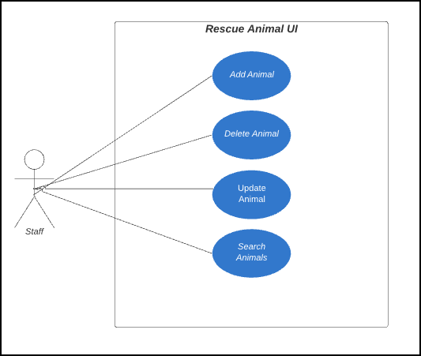</h4> 


I researched and selected my development tools during the project’s design phase. I chose a MERN stack because it is a popular and scalable full-stack environment (MongoDB, 2021). The MERN stack uses MongoDB, Express, React, and Node.JS as its primary technologies. However, I added additional technologies for backend testing, such as Jest and Mongo Memory Server. I also included the ag-grid module and bootstrap for frontend styling. Researching these technologies gave me a deeper understanding of web development and how the pieces of full-stack applications interact. 


I began enhancements for this project by reinitializing the database in Mongo Atlas. The database was originally in a virtual lab environment provided by my university. Mongo Atlas allowed the node development server to interact with the database in the cloud. This program is an internal application to help non-technical staff manage the database, and it does not include a log-in feature. However, the default account follows the principle of least privilege and only has access to the animal collection. I also cleaned up the database by removing redundant fields and renaming variables to follow consistent naming conventions. Finally, I added variables to store image URLs and set the reserved status for search and rescue animals. These enhancements taught me how to work with Mongo Atlas from the mongo shell to manage my database. The images below show the improvements to the database schema.  


<h4 align="center">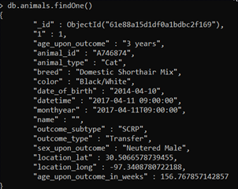</h4> 
<h4 align="center">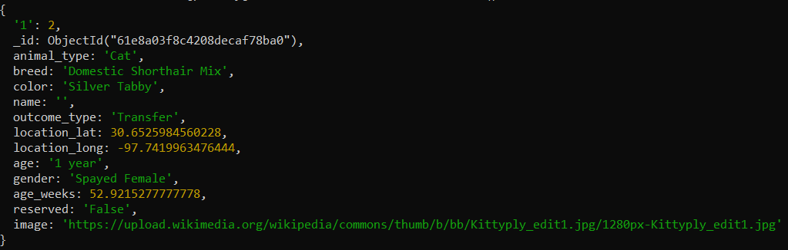</h4> 


Next, I developed middleware to update, delete, create, and search for rescue animals using Node.JS and Express. I structured the project into frontend and backend folders to manage the development server, middleware, and user interface. I used Jest and Mongo Memory Server for endpoint testing. I had no experience with Node or Express before working on these enhancements. I learned that Node is a powerful development tool that can guide many personal and professional projects in the future. I also gained experience with testing frameworks for full-stack development.


<h4 align="center">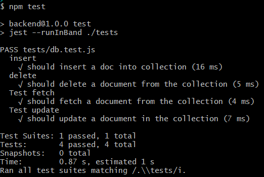</h4> 


Finally, I developed the user interface to interact with my middleware using React and CSS. I displayed the search and rescue dogs on cards in a grid layout with the animal’s images to make the interface more visually appealing. Users can edit the animal’s information to reserve them for rescue missions from the card’s edit button. I also included a table to view and filter all shelter animals using the ag-grid module. However, the table does not contain edit and delete functionalities since this platform only manages the search and rescue dogs.  


Next, I developed the forms to add and edit search and rescue animals. I incorporated input validation to enhance security. I also developed an interactive navigation bar by adding a drop-down menu with filters for the different search and rescue types. The drop-down items change colors when hovering over selections. The navigation also includes links to view all shelter animals and intake animals. I included media queries to alter the display of the navigation element on smaller screens. These enhancements demonstrate my ability to develop responsive user interfaces for database management. The images below show samples of the user interface. 

<h4 align="center">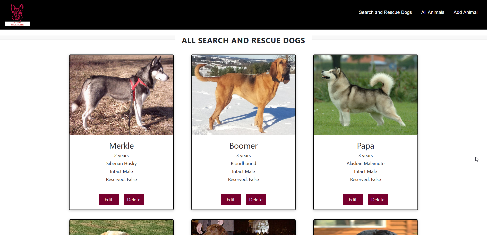</h4> 
<h4 align="center">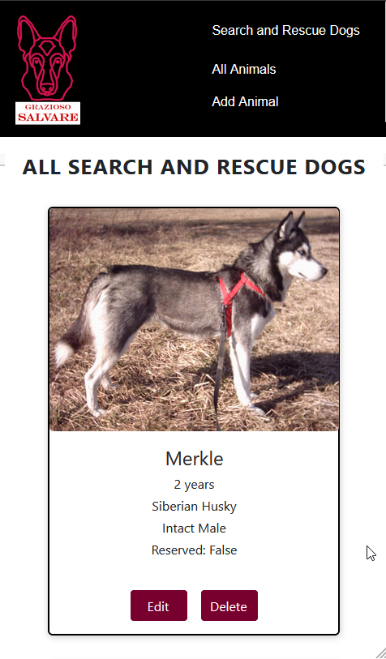</h4> 
<h4 align="center">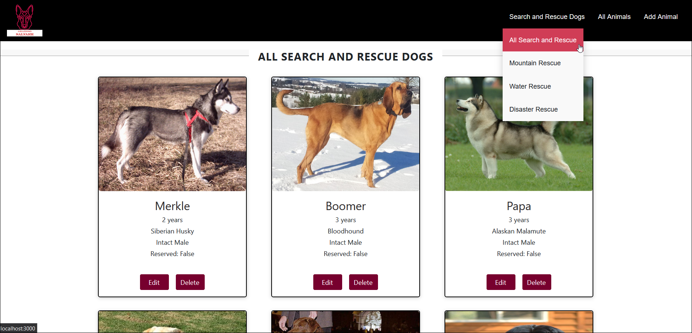</h4> 
<h4 align="center">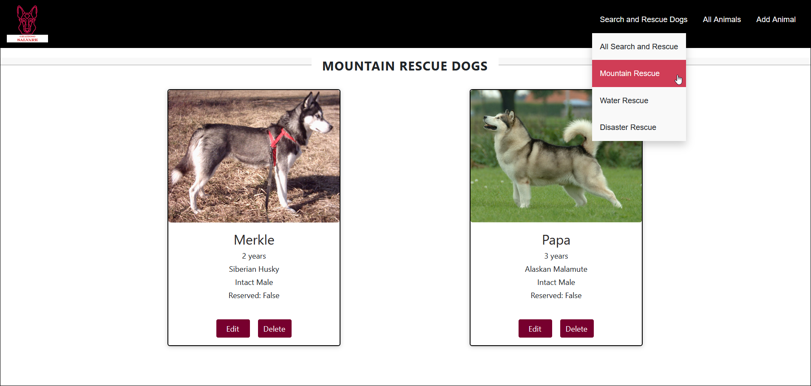</h4>
<h4 align="center">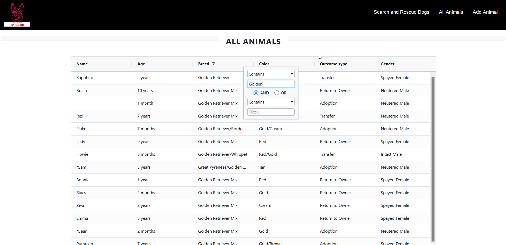</h4>
<p align="middle">
    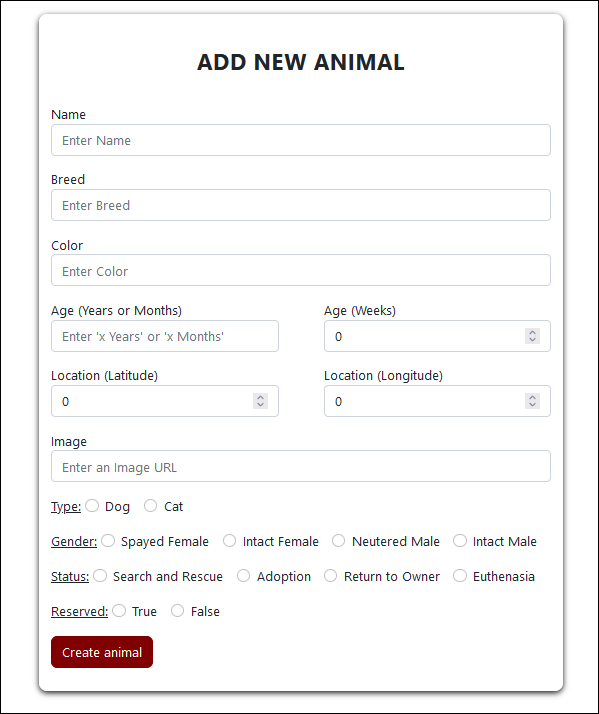     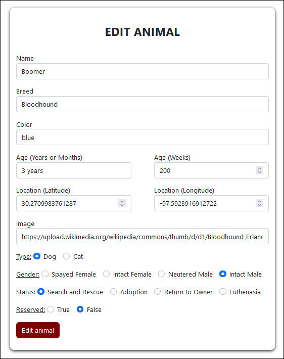
</p>


### Reflection

I improved this artifact by converting it to a more popular and versatile full-stack framework. This experience measuring trade-offs between technology selections will be valuable to my future career as a software developer. I faced several challenges initializing my MERN stack because I had limited experience with these technologies. I found a tutorial in MongoDB’s documentation that helped tremendously. This tutorial filled my knowledge gaps and helped me quickly connect the project’s pieces using a Node module called MongoDB (MongoDB, 2021). I also faced some challenges incorporating testing because I had never used the Jest testing framework. I found a guide for database testing with Jest for MongoDB that helped me set up a Mongo Memory Server to mimic my database in memory rather than testing on the live database (NPM, 2022). These enhancements provided a valuable learning experience because they were challenging and gave me more experience developing and testing full-stack applications.


The hurdles I faced developing the frontend were styling the responsive search grid and incorporating media queries. The MDN Web Docs for frontend development helped with the user interface because I had minimal experience in this area (MDN, 2022). The CSS documentation guided element styling for my project. I used bootstrap to style the form elements. I also used the ag-grid package for React to develop the interactive table for all shelter animals. This project made me more comfortable with CSS and media queries. The rescue animal application gave me full control of project development from the design phase. My experiences designing and developing this project sharpened my software engineering skills and gave me experience with in-demand technologies. Furthermore, the code review, project proposal, and narratives gave me experience communicating design designs to project stakeholders. 

<h3 align="center">References</h3>
<ol>
  <li>
    <p>MDN Web Docs. (2022). <cite>Resources for Developer, by Developers.</cite> https://developer.mozilla.org/en-US/ </p>
  </li>
  <li>
    <p>MongoDB. (2021). <cite>MERN Stack Explained.</cite>https://www.mongodb.com/mern-stack</p> 
  </li>
  <li>
    <p>MongoDB. (2021). <cite>How to Use MERN Stack: A Complete Guide</cite>https://www.mongodb.com/languages/mern-stack-tutorial </p> 
  </li>
  <li>
    <p>NPM. (2022). <cite>Jest-MongoDB.</cite> https://www.npmjs.com/package/@shelf/jest-mongodb </p>
  </li>
</ol>
